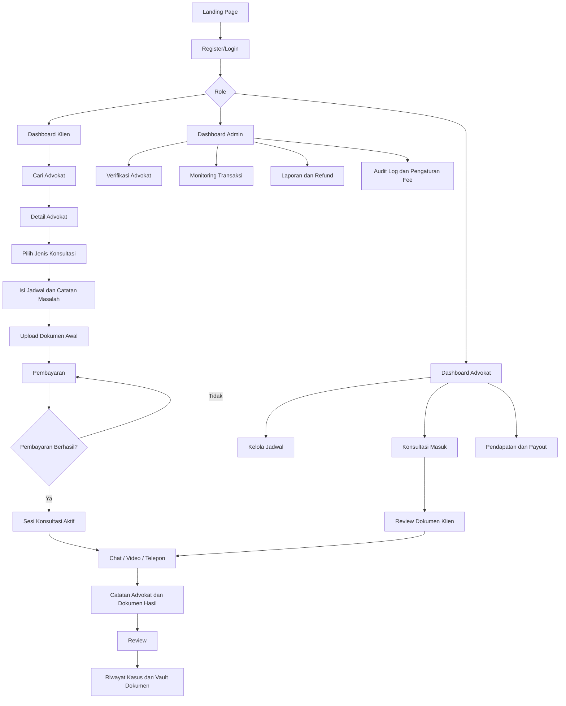
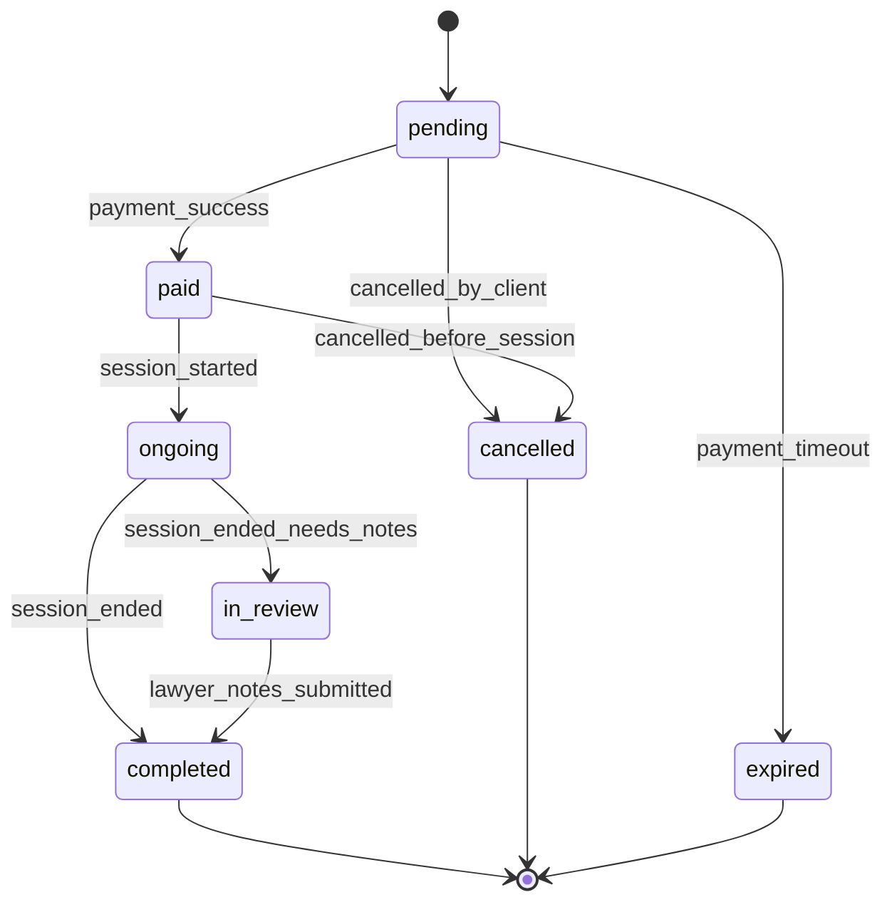

# YDA LAW OFFICE & Partners System Blueprint

YDA LAW OFFICE & Partners adalah platform konsultasi hukum digital bergaya Halodoc, tetapi untuk layanan advokat. Fokusnya adalah mempercepat klien menemukan advokat yang tepat, menjadwalkan konsultasi, membayar secara aman, berkonsultasi via chat/video/telepon, menyimpan dokumen hukum, dan melacak progres kasus.

## Visi Produk

YDA LAW OFFICE & Partners bukan sekadar direktori advokat. Sistem ini harus terasa seperti ruang konsultasi hukum yang lengkap:

- Klien dapat mencari advokat berdasarkan masalah hukum, harga, rating, pengalaman, bahasa, dan ketersediaan.
- Advokat dapat menerima konsultasi, mengatur jadwal, membaca dokumen awal, memberi catatan, mengirim legal opinion, dan mengelola pendapatan.
- Admin dapat memverifikasi advokat, memantau transaksi, menangani laporan, mengatur fee platform, dan menjaga kualitas layanan.

## Role Utama

### Klien

Klien adalah pengguna yang membutuhkan bantuan hukum.

Hak akses klien:

- Membuat akun dan login.
- Melengkapi profil pribadi.
- Mencari dan memfilter advokat.
- Melihat detail advokat.
- Memilih jenis konsultasi.
- Mengunggah dokumen awal.
- Melakukan pembayaran.
- Chat, video call, atau telepon.
- Melihat riwayat kasus.
- Mengelola vault dokumen.
- Memberi review setelah konsultasi.
- Mengajukan refund atau bantuan.

### Advokat

Advokat adalah penyedia layanan konsultasi.

Hak akses advokat:

- Mendaftar sebagai advokat.
- Mengunggah dokumen verifikasi seperti KTP, izin praktik, sertifikat, dan foto profil.
- Menunggu verifikasi admin.
- Mengatur profil, spesialisasi, harga, bahasa, pendidikan, dan sertifikasi.
- Mengatur jadwal konsultasi.
- Menerima atau menolak booking.
- Membaca ringkasan masalah dan dokumen klien.
- Menjawab chat dan melakukan sesi video/telepon.
- Mengirim catatan hukum, legal opinion, atau dokumen hasil konsultasi.
- Melihat riwayat klien.
- Melihat saldo dan riwayat pencairan.

### Admin

Admin menjaga operasional platform.

Hak akses admin:

- Memverifikasi advokat.
- Menyetujui, menolak, atau menangguhkan akun advokat.
- Memantau user aktif.
- Memantau konsultasi dan transaksi.
- Mengatur biaya platform.
- Melihat audit log.
- Menangani laporan user.
- Memproses refund.
- Mengelola kategori hukum.

## Alur Produk End-to-End

## Modul Sistem

### 1. Authentication and Role Gate

Tujuan:

- User tidak bisa masuk tanpa akun.
- Register menyimpan user ke database.
- Login mengecek email, password, role, dan status akun.

Status saat ini:

- Authentication sudah pindah ke Supabase Auth (`signUp`, `signInWithPassword`, session restore, sign out).
- Database runtime memakai Supabase Postgres dengan RLS policies.
- Role internal tetap `client`, `lawyer`, `admin`, tetapi UI memakai `Klien`, `Advokat`, `Admin`.

Perlu dikembangkan:

- Review RLS policy untuk endpoint production.\r\n- Edge Function atau backend service untuk operasi rahasia seperti payment webhook.
- OTP email atau WhatsApp untuk verifikasi.
- Reset password.

### 2. Lawyer Discovery

Tujuan:

- Klien bisa menemukan advokat yang cocok secepat mungkin.

Fitur:

- Search berdasarkan nama, spesialisasi, kategori, dan kata kunci masalah.
- Filter harga, pengalaman, rating, bahasa, online/offline.
- Sort rekomendasi: relevansi, rating, harga terendah, pengalaman, paling cepat tersedia.
- Badge advokat: terverifikasi, online, fast response, top rated.

Data utama:

- `lawyer_profiles`
- `lawyer_categories`
- `lawyer_languages`
- `lawyer_availability`
- `reviews`

API prioritas:

- `GET /api/lawyers`
- `GET /api/lawyers/:id`
- `GET /api/lawyers/:id/availability`
- `GET /api/categories`

### 3. Booking and Scheduling

Tujuan:

- Klien memilih advokat, jenis konsultasi, jadwal, dan catatan masalah.

Jenis konsultasi:

- Chat cepat.
- Video call.
- Telepon.
- Konsultasi terjadwal.

Status konsultasi:

- `pending`: booking dibuat, belum bayar.
- `paid`: pembayaran berhasil.
- `ongoing`: konsultasi sedang berjalan.
- `in_review`: advokat sedang meninjau dokumen atau membuat catatan.
- `completed`: konsultasi selesai.
- `cancelled`: dibatalkan.
- `expired`: sesi kedaluwarsa.

Data utama:

- `app_consultations`
- `consultation_status_logs`
- `lawyer_availability`

API prioritas:

- `POST /api/consultations`
- `GET /api/consultations/me`
- `GET /api/consultations/:id`
- `PATCH /api/consultations/:id/status`

### 4. Payment and Escrow Logic

Tujuan:

- Klien membayar sebelum konsultasi.
- Dana tidak langsung dianggap selesai sampai sesi berjalan atau selesai.
- Admin bisa mengatur fee platform dan refund.

Alur:

1. Klien membuat booking.
2. Sistem menghitung harga konsultasi, pajak, admin fee, dan total.
3. Klien memilih metode pembayaran.
4. Payment record dibuat dengan status `pending`.
5. Jika payment berhasil, konsultasi menjadi `paid`.
6. Setelah konsultasi selesai, payout advokat dihitung.

Data utama:

- `app_payments`
- `lawyer_payouts`
- `app_settings`

API prioritas:

- `POST /api/payments`
- `POST /api/payments/:id/confirm`
- `POST /api/payments/:id/refund`
- `GET /api/admin/transactions`

Catatan:

- Untuk lokal bisa simulasi payment.
- Untuk production bisa pakai Midtrans, Xendit, atau payment gateway lain.

### 5. Consultation Room

Tujuan:

- Ruang konsultasi yang terasa aman, fokus, dan profesional.

Mode konsultasi:

- Chat.
- Video call.
- Voice call.
- Document sharing.

Fitur penting:

- Timer sesi.
- Status online advokat.
- Upload file di chat.
- Quick notes advokat.
- End session.
- Auto-create review prompt setelah sesi selesai.

Data utama:

- `chat_sessions`
- `messages`
- `documents`
- `app_consultations`

API prioritas:

- `POST /api/chat-sessions`
- `GET /api/chat-sessions/:id/messages`
- `POST /api/chat-sessions/:id/messages`
- `PATCH /api/chat-sessions/:id/end`

Catatan:

- Chat realtime idealnya memakai WebSocket.
- Video call bisa dimulai dengan simulasi lokal, lalu di production memakai WebRTC atau provider seperti Daily, Twilio, Agora, atau Vonage.

### 6. Document Vault

Tujuan:

- Semua dokumen hukum tersimpan dan terhubung ke konsultasi.

Fitur:

- Upload dokumen identitas, bukti, kontrak, surat kuasa, legal opinion.
- Kategori dokumen.
- Visibility: private, shared with lawyer, shared with client.
- Link dokumen ke konsultasi tertentu.
- Download.
- Audit siapa yang upload dan kapan.

Data utama:

- `documents`
- `audit_logs`

API prioritas:

- `POST /api/documents`
- `GET /api/documents/me`
- `GET /api/consultations/:id/documents`
- `PATCH /api/documents/:id/visibility`

### 7. Case History

Tujuan:

- Klien dan advokat dapat melihat riwayat konsultasi sebagai arsip kasus.

Isi riwayat:

- Advokat.
- Kategori hukum.
- Tanggal dan waktu.
- Status.
- Catatan advokat.
- Dokumen terkait.
- Payment status.
- Review.
- Tombol lanjut diskusi.

Data utama:

- `app_consultations`
- `consultation_status_logs`
- `documents`
- `reviews`
- `app_payments`

### 8. Review and Trust Score

Tujuan:

- Meningkatkan kepercayaan dan kualitas advokat.

Fitur:

- Rating 1 sampai 5.
- Review teks.
- Tag pengalaman seperti responsif, jelas, profesional.
- Review hanya boleh dari konsultasi yang sudah selesai.
- Rating advokat dihitung ulang setelah review masuk.

Data utama:

- `reviews`
- `lawyer_profiles.rating`
- `lawyer_profiles.review_count`

API prioritas:

- `POST /api/reviews`
- `GET /api/lawyers/:id/reviews`

### 9. Lawyer Dashboard

Tujuan:

- Advokat bisa mengelola kerja harian dari satu tempat.

Widget utama:

- Pendapatan bulan ini.
- Jadwal hari ini.
- Konsultasi menunggu.
- Klien aktif.
- Dokumen baru.
- Tombol upload legal opinion.
- Riwayat transaksi.
- Status pencairan.

API prioritas:

- `GET /api/lawyer/dashboard`
- `GET /api/lawyer/consultations`
- `GET /api/lawyer/payouts`
- `PATCH /api/lawyer/availability`

### 10. Admin Dashboard

Tujuan:

- Mengontrol kualitas, keamanan, dan uang platform.

Fitur:

- Overview revenue, active users, active lawyers.
- Verifikasi advokat.
- Suspensi user.
- Laporan dan sengketa.
- Refund.
- Platform fee config.
- Audit log.

API prioritas:

- `GET /api/admin/dashboard`
- `GET /api/admin/lawyers/pending`
- `PATCH /api/admin/lawyers/:id/verify`
- `GET /api/admin/reports`
- `PATCH /api/admin/settings`

## Sistem Status Konsultasi

## Struktur Database Saat Ini

Database Supabase Postgres menjadi fondasi runtime. Tabel utama:

- `profiles`
- `client_profiles`
- `lawyer_profiles`
- `legal_categories`
- `languages`
- `lawyer_categories`
- `lawyer_languages`
- `lawyer_education`
- `lawyer_certifications`
- `lawyer_availability`
- `app_consultations`
- `consultation_status_logs`
- `app_payments`
- `lawyer_payouts`
- `chat_sessions`
- `messages`
- `documents`
- `reviews`
- `support_tickets`
- `admin_reports`
- `app_settings`
- `audit_logs`

Tambahan yang disarankan:

- `password_reset_tokens`
- `otp_codes`
- `lawyer_verification_documents`
- `refund_requests`
- `notifications`
- `device_sessions`
- `saved_lawyers`

## API Roadmap

### Public API

- `GET /api/health`
- `GET /api/categories`
- `GET /api/lawyers`
- `GET /api/lawyers/:id`
- `POST /api/auth/register`
- `POST /api/auth/login`
- `POST /api/auth/forgot-password`
- `POST /api/auth/reset-password`

### Klien API

- `GET /api/me`
- `PATCH /api/me`
- `POST /api/consultations`
- `GET /api/consultations/me`
- `GET /api/consultations/:id`
- `POST /api/payments`
- `GET /api/documents/me`
- `POST /api/documents`
- `POST /api/reviews`

### Advokat API

- `GET /api/lawyer/dashboard`
- `PATCH /api/lawyer/profile`
- `GET /api/lawyer/consultations`
- `PATCH /api/lawyer/consultations/:id/status`
- `PATCH /api/lawyer/availability`
- `POST /api/lawyer/legal-opinions`
- `GET /api/lawyer/payouts`

### Admin API

- `GET /api/admin/dashboard`
- `GET /api/admin/users`
- `GET /api/admin/lawyers/pending`
- `PATCH /api/admin/lawyers/:id/verify`
- `GET /api/admin/transactions`
- `GET /api/admin/reports`
- `PATCH /api/admin/reports/:id`
- `PATCH /api/admin/settings`

## UX Flow Prioritas

### Flow Klien Ideal

1. Klien membuka landing page.
2. Klien memilih `Cari Advokat`.
3. Klien filter masalah hukum, misalnya perceraian atau kontrak.
4. Klien masuk ke detail advokat.
5. Klien melihat harga, rating, pengalaman, bahasa, jadwal.
6. Klien memilih chat/video/telepon/booking.
7. Klien mengisi ringkasan masalah.
8. Klien upload dokumen awal jika perlu.
9. Klien bayar.
10. Klien masuk ruang konsultasi.
11. Advokat memberi catatan atau dokumen hasil.
12. Klien memberi review.
13. Semua tersimpan di riwayat kasus dan vault dokumen.

### Flow Advokat Ideal

1. Advokat daftar.
2. Advokat upload dokumen verifikasi.
3. Admin memverifikasi.
4. Advokat melengkapi profil, jadwal, harga, spesialisasi.
5. Advokat menerima booking.
6. Advokat membaca catatan dan dokumen awal.
7. Advokat melakukan konsultasi.
8. Advokat mengirim catatan atau legal opinion.
9. Sistem menghitung pendapatan.
10. Advokat menarik saldo.

### Flow Admin Ideal

1. Admin login.
2. Admin cek advokat pending.
3. Admin verifikasi dokumen.
4. Admin monitor konsultasi dan transaksi.
5. Admin tangani laporan/refund.
6. Admin evaluasi audit log dan kualitas platform.

## Prioritas Implementasi

### Tahap 1 - Fondasi Nyata

- Rapikan auth.
- Tambahkan bcrypt dan JWT.
- Buat middleware auth.
- Sambungkan daftar advokat ke MySQL.
- Buat endpoint detail advokat.
- Buat endpoint kategori hukum.

### Tahap 2 - Booking dan Payment Simulasi

- Buat booking tersimpan ke `consultations`.
- Buat payment simulasi tersimpan ke `payments`.
- Ubah status konsultasi otomatis setelah pembayaran.
- Tampilkan riwayat konsultasi dari database.

### Tahap 3 - Chat dan Dokumen

- Simpan chat session dan messages ke database.
- Upload metadata dokumen ke `documents`.
- Tampilkan vault dokumen dari database.
- Hubungkan dokumen dengan konsultasi.

### Tahap 4 - Dashboard Role

- Dashboard klien dari database.
- Dashboard advokat dari database.
- Dashboard admin dari database.
- Verifikasi advokat via admin.

### Tahap 5 - Production Readiness

- JWT refresh token.
- Rate limit.
- File storage.
- Payment gateway.
- WebSocket chat.
- WebRTC/video provider.
- Audit log lengkap.
- Error monitoring.

## Prinsip Desain Produk

- Hukum itu sensitif, jadi UI harus terasa tenang, jelas, dan terpercaya.
- Setiap harga harus transparan sebelum pembayaran.
- Setiap sesi harus punya status yang mudah dipahami.
- Dokumen harus selalu punya kontrol akses.
- Advokat harus terlihat kredibel melalui verifikasi, sertifikasi, rating, dan riwayat.
- Admin harus bisa melacak semua aksi penting melalui audit log.

## Naming Rekomendasi

Di UI gunakan bahasa Indonesia:

- `client` ditampilkan sebagai `Klien`.
- `lawyer` ditampilkan sebagai `Advokat`.
- `admin` ditampilkan sebagai `Admin`.
- `consultation` ditampilkan sebagai `Konsultasi`.
- `document vault` ditampilkan sebagai `Vault Dokumen` atau `Arsip Dokumen`.
- `payment` ditampilkan sebagai `Pembayaran`.
- `case history` ditampilkan sebagai `Riwayat Kasus`.

Di kode dan database tetap gunakan bahasa Inggris agar konsisten dengan struktur teknis:

- `client`
- `lawyer`
- `admin`
- `app_consultations`
- `app_payments`
- `documents`
- `reviews`

## Rekomendasi Halaman Akhir

Halaman yang perlu ada saat produk matang:

- Landing Page
- Login
- Register Klien
- Register Advokat
- Verifikasi Advokat
- Dashboard Klien
- Cari Advokat
- Detail Advokat
- Booking Konsultasi
- Pembayaran
- Ruang Chat
- Ruang Video/Telepon
- Riwayat Kasus
- Vault Dokumen
- Review
- Help Center
- Dashboard Advokat
- Jadwal Advokat
- Klien Advokat
- Pendapatan Advokat
- Dashboard Admin
- Verifikasi Advokat Admin
- Transaksi Admin
- Laporan Admin
- Pengaturan Platform Fee

## Keputusan Produk

YDA LAW OFFICE & Partners sebaiknya tidak dibuat sebagai website informasi biasa. YDA LAW OFFICE & Partners harus menjadi aplikasi operasional: setelah login, user langsung masuk ke dashboard sesuai role dan bisa melakukan tindakan utama tanpa banyak halaman promosi.

Pengalaman terbaik untuk versi awal:

- Landing page singkat untuk menarik user.
- Login/register jelas.
- Klien langsung diarahkan ke pencarian advokat.
- Advokat langsung diarahkan ke jadwal dan request masuk.
- Admin langsung diarahkan ke verifikasi dan transaksi.

